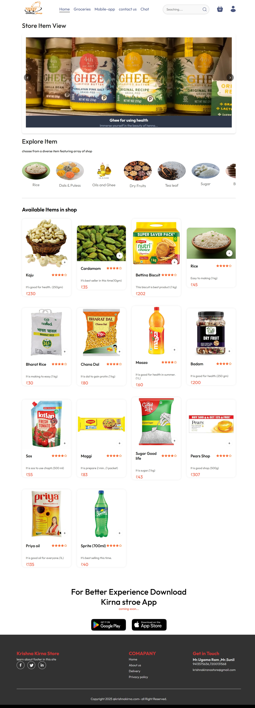
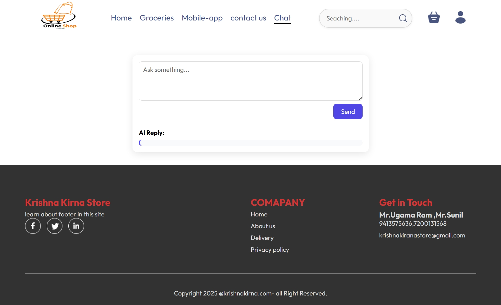
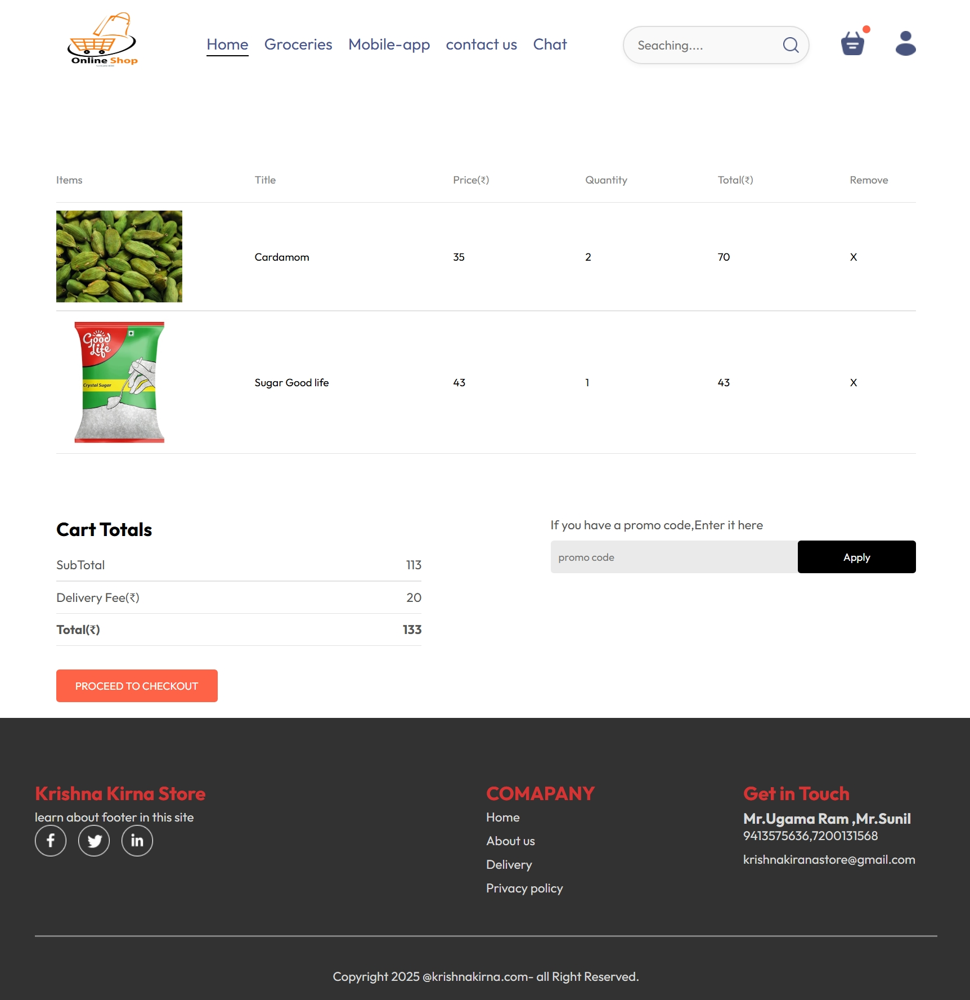
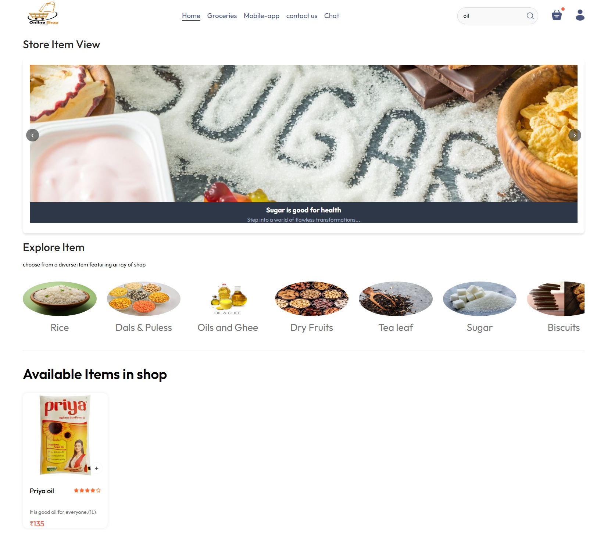
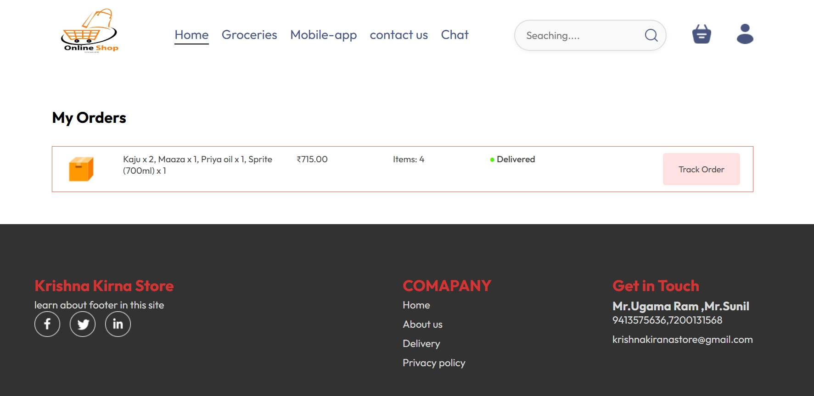
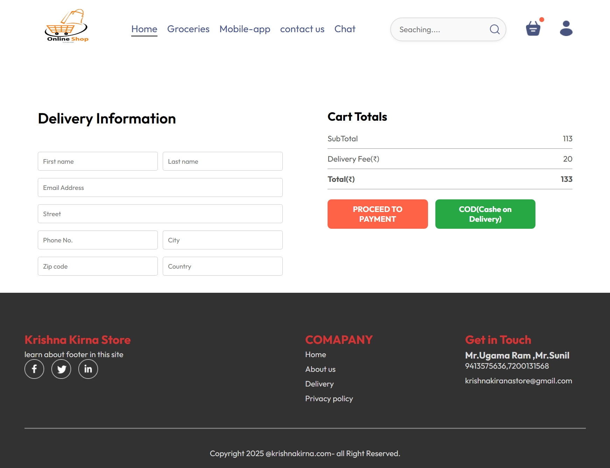

# This is Shopping Website.It is working Properly at shop.

## frontend url = "https://krishna-kirna-store-kks.onrender.com"

## backend url = "https://food-delivery-backend-4u6z.onrender.com"

## admin url = contact admin

### 🛒 Grocery Items Website
A full-featured web application that allows users to browse, search, and manage grocery items. This project is designed for learning and demonstration purposes, showcasing full-stack development skills.

### 📌 Features
User registration and login

Browse and search grocery items

Add items to cart and wishlist

Admin panel to manage products

Responsive UI for desktop and mobile

Order placement and status tracking

### 🧰 Tech Stack
#### Frontend

HTML, CSS, JavaScript, React.js, Restful APIs

#### Backend

Node.js, Express.js

MongoDB & Mongoose for database

### 🚀 Getting Started
Follow these instructions to get a copy of the project running on your local machine.

Prerequisites
Node.js and npm installed

MongoDB Atlas URI

Installation
Clone the repository:

bash
Copy
Edit
git clone https://github.com/BharatKumawat63777/DailyGrocer.git
cd DailyGrocer
Install dependencies:

bash
Copy
Edit
npm install
Set up environment variables:
Create a .env file in the root directory and add the following:

ini
Copy
Edit
MONGODB_URI=your_mongo_uri
JWT_SECRET=your_jwt_secret
PORT=5000
Start the server:

bash
Copy
Edit
npm start
Open the website in your browser:

arduino
Copy
Edit
http://localhost:5000

### 🧪 Future Improvements
Email notifications for orders

Product reviews and ratings

Payment gateway integration

Dark mode

### 🙋‍♂️ Author
Bharat
(https://github.com/BharatKumawat63777/)

## User Interaction Photos

#### 🏠 Homepage

#### Chat with AI

#### 🛒 Adding items to cart

#### 🔍 Searching for Items

#### ✅ Order confirmation

#### 📬 Filling delivery/receiver info

## Admin Portal

