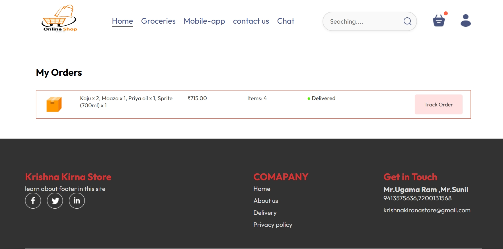
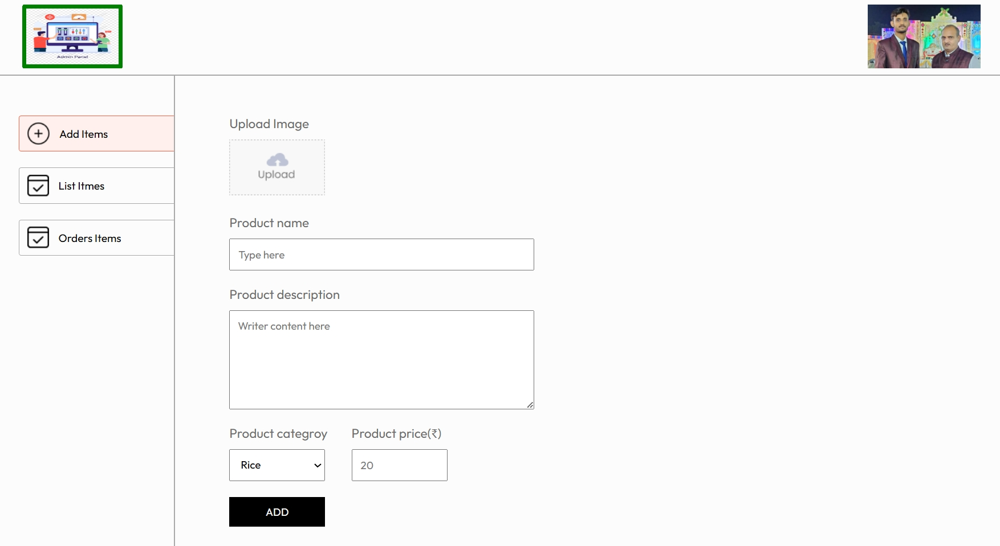
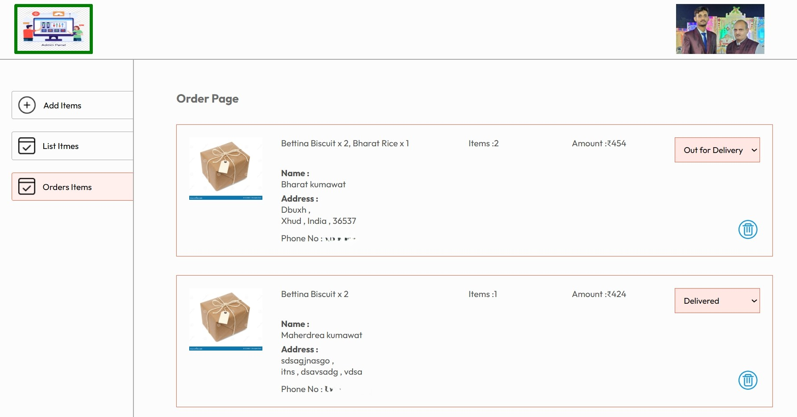
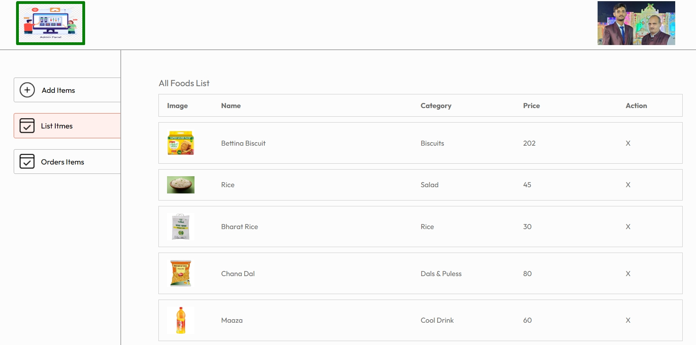

# Users Interaction (Frontend)

### 🛒 Grocery Items Website
A full-featured web application that allows users to browse, search, and manage grocery items. This project is designed for learning and demonstration purposes, showcasing full-stack development skills.

### 📌 Features
User registration and login

Browse and search grocery items

Add items to cart and wishlist

Admin panel to manage products

Responsive UI for desktop and mobile

Order placement and status tracking

### 🧰 Tech Stack
#### Frontend

HTML, CSS, JavaScript, React.js, Restful APIs

#### Backend

Node.js, Express.js

MongoDB & Mongoose for database

### 🚀 Getting Started
Follow these instructions to get a copy of the project running on your local machine.

Prerequisites
Node.js and npm installed

MongoDB Atlas URI

Installation
Clone the repository:

bash
Copy
Edit
git clone https://github.com/BharatKumawat63777/DailyGrocer.git
cd DailyGrocer
Install dependencies:

bash
Copy
Edit
npm install
Set up environment variables:
Create a .env file in the root directory and add the following:

ini
Copy
Edit
MONGODB_URI=your_mongo_uri
JWT_SECRET=your_jwt_secret
PORT=5000
Start the server:

bash
Copy
Edit
npm start
Open the website in your browser:

arduino
Copy
Edit
http://localhost:5000

### 🧪 Future Improvements
Email notifications for orders

Product reviews and ratings

Payment gateway integration

Dark mode

### 🙋‍♂️ Author
Bharat
(https://github.com/BharatKumawat63777/)

## User Interaction Photos

### 🏠 Homepage

### Chat with AI

### 🛒 Adding items to cart

### 🔍 Searching for Items

### ✅ Order confirmation

### 📬 Filling delivery/receiver info

# 🛠️Admin Panel

The Admin Panel allows authorized users to manage all backend operations of the grocery platform. It provides full control over products, orders, users, and inventory.

## 🧰 Features

#### 🛍️ Product Management

Add, edit, or delete grocery items

#### Upload product images

Set price and category

#### 📦 Order Management

View all customer orders

Change order status: Pending, Packed, Shipped, Delivered

Track payment and delivery details

#### 👥 User Management

View registered users

Promote or revoke admin access

Delete suspicious or inactive accounts

## 🧑‍💻 Tech Stack (Admin Side)
Node.js + Express.js for backend logic

MongoDB for storing order, and product data

Admin routes protected with JWT authentication

Admin UI :  React & Bootstrap admin dashboard

## 🧪 Future Improvements

See total sales, number of orders, and user activity

Visual charts for revenue and inventory trends (optional)

## Photos

### Add-Items

### Ordered Items

### List Items

